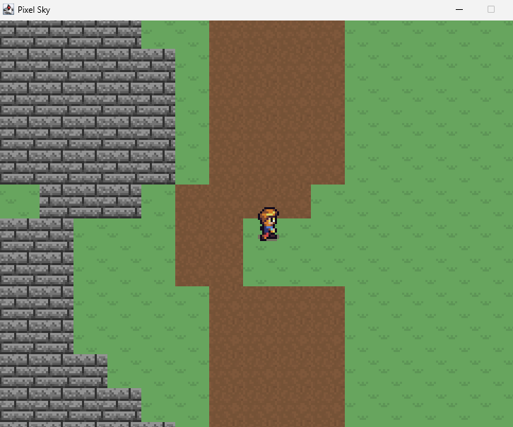
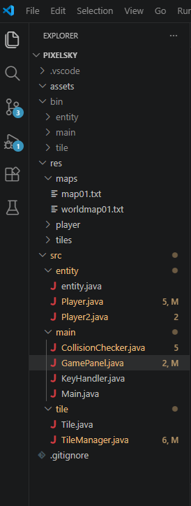

## Screenshots

### Gameplay(Movement, rendering)


### Project structure


---

# Features:

- Tile-based world rendering
- Sprite rendering and animation
- Keyboard input handling
- Collision detection system (in progress)
- Map loading through text-based world files
- Entity and player movement systems
- Custom game loop implementation
- Resource loading and management
- Object-oriented game architecture

---

# Technologies:

- Java
- Java Swing / AWT
- Object-Oriented Programming (OOP)

No external libraries, engines, or frameworks were used in the development of this project.

---

# How to run:
Reqs:
- Install Java JDK 21
- If using VS code ensure Java extensions are configured and downloaded

  Running the Game:
  - Clone the repository, then run in whatever environment you prefer.
# Project purpose:
This project was built as a learning-focused engine to better understand the lower-level architecture behind 2D game development and software systems in Java.

The primary focus was understanding:

rendering pipelines
update loops
collision systems
entity management
resource handling
object-oriented software structure

by implementing systems manually rather than abstracting them away through existing game engines.

# Project Structure:

```text
src/
├── entity/
├── main/
└── tile/

res/
├── maps/
├── player/
└── tiles/

---
